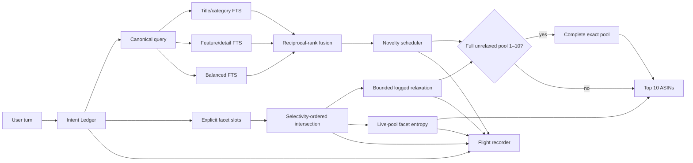

# Architecture

## Design principle

Shopping dialogue is modeled as a changing specification, not a concatenated prompt. Retrieval remains deterministic and offline; state, ranking, clarification, and observability have explicit boundaries.

## Boundaries

### Intent Ledger

Each constraint stores value, attribute, hardness, polarity, confidence, source turn, active state, and optional superseding turn. Corrections deactivate affected preferences without destroying history. No-preference answers close an attribute without adding a negative product constraint.

### Progressive Retrieval Portfolio

The same bounded lexical query is evaluated under three field-weight configurations:

- Title/category-heavy for product identity and taxonomy
- Feature/detail-heavy for requirements and metadata
- Balanced for robustness

Each view returns up to 100 candidates. Reciprocal-rank fusion uses `1 / (20 + rank)`, with deterministic best-rank and ASIN tie-breakers. When the normalized query is unchanged, page `n+1` is returned after page `n` misses. Any new query term resets to page zero.

### Facet Graph and hybrid gate

Active slots resolve to explicit FTS5 or numeric posting lists. Categories use an AND across taxonomy tokens, controlled values such as `color: red` canonicalize to `red`, and price ceilings use the numeric catalog field. Posting lists are intersected in ascending cardinality order. An empty conjunction invokes at most three logged relaxations, prioritizing low-confidence soft clauses.

The default hybrid accepts facet output only when the original strict conjunction is non-empty, required no relaxation, and contains at most ten products. Because the output cap is ten, this is a semantic completeness condition rather than a learned confidence score. Every other case uses the progressive portfolio.

### Question ROI

The pure facet mode computes Shannon entropy over catalog values in the live pool and chooses the largest ID3-style information gain among material, color, size, style, budget, use case, and brand. Questions include only values observed in that pool. The trace records expected remaining candidates and a two-point entropy-collapse curve.

The implementation reports a branching-factor lower bound and recursively computes the exact expected depth of its own finite greedy tree. If remaining facets cannot separate a leaf to ten products, it reports the unresolved fraction and no finite upper bound. This is evidence about the constructed policy—not a universal near-optimality theorem for ID3.

### Recovery

Failures are contained within one turn. A retrieval exception falls back to the last valid ranking or deterministic popularity order. The agent never retries an external service because no external service exists in the scored path.

### Flight recorder

Each trace event records the active/tombstoned ledger, route, query terms, question decision, page, candidate count, recommendations, latency, and failure state. It contains no aggregate user profile. Traces are in memory unless an explicit directory is configured.

## Complexity

- Index construction: linear in catalog text size
- One hybrid turn: three FTS top-100 queries plus deterministic facet posting intersections; only a complete pool of at most ten replaces the portfolio
- Session state: bounded to 80 unique query terms and ten protocol turns
- Persistent external state: none by default

## Extension points

- Replace or augment one view without changing the Agent interface.
- Add a character n-gram fallback behind a confidence gate.
- Replace deterministic parsing while preserving the ledger contract.
- Export traces to an observability backend outside official scoring.
